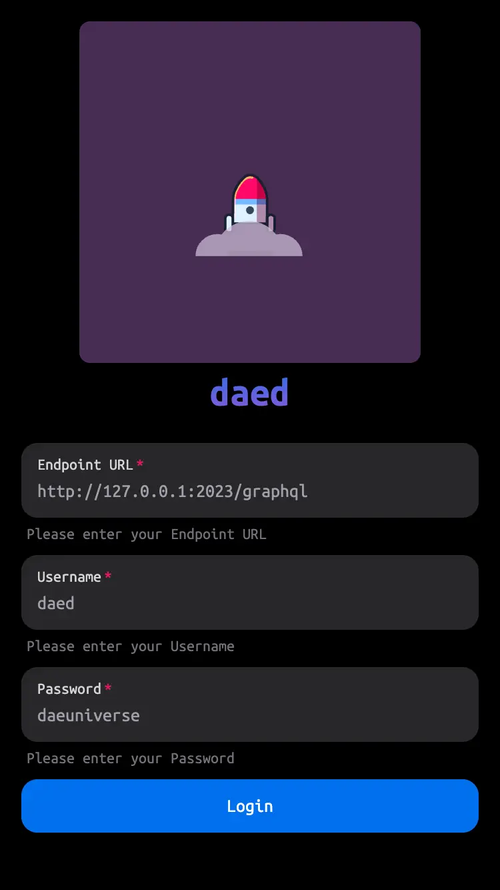

# daed

A modern web dashboard for dae


## Preview



## Features

- [x] Easy to use, with keyboard navigation / shortcuts builtin
- [x] Beautiful and intuitive UI
- [x] Light / Dark mode
- [x] Mobile friendly

## Getting started

### Prerequisites

#### Install the toolchain

> Git is required to fetch the source code

- [Git](https://git-scm.com)

> Install the docker engine if you choose to build and run in docker

- [Docker](https://www.docker.com)

> Install the build toolchain if you choose to build from the source files on your own

- [Golang](https://go.dev), [GNU GCC](https://gcc.gnu.org) (required by dae-wing)
- [Node.js](https://nodejs.org), [pnpm](https://pnpm.io) (required by daed)

#### Fetch the source code

> Clone the repository with git submodules (dae-wing) using git

```shell
git clone https://github.com/daeuniverse/daed-revived-next.git daed
cd daed

# Initialize git submodules
git submodule update --init --recursive
```

#### Build and run dae-wing

> Build dae-wing

```shell
cd wing

make deps
go build -o dae-wing
```

> Run dae-wing with root privileges

```shell
sudo ./dae-wing run -c ./
```

Learn more about dae-wing at [dae-wing](https://github.com/daeuniverse/dae-wing)

### Customize daed with `.env.local` file

Create a `.env.local` file to customize daed

| Name         | Default               | Required | Description                          |
| ------------ | --------------------- | -------- | ------------------------------------ |
| WING_API_URL | http://localhost:2023 | ✅       | Set the API Endpoint URL of dae-wing |
| HOSTNAME     | 0.0.0.0               | ⬜       | Set the HTTP Hostname of daed        |
| PORT         | 3000                  | ⬜       | Set the HTTP Port of daed            |

### Docker

> Build the docker image

```shell
docker build -t daed .
```

> Run the docker image you just build in the background

```shell
docker run -d --name daed -p 3000:3000 daed
```

### From Source

> Install Dependencies

```shell
pnpm install
```

> Build Artifacts

```shell
pnpm run build
```

> Run Server

```shell
pnpm start
```

## Contributing

Feel free to open issues or submit your PR, any feedbacks or help are greatly appreciated.

Special thanks go to all these amazing people.

[](https://github.com/daeuniverse/daed/graphs/contributors)

If you would like to contribute, please see the [instructions](CONTRIBUTING.md). Also, it is recommended following the [commit message guide](docs/commit-msg-guide.md).

## Credits

- [dae-wing](https://github.com/daeuniverse/dae-wing)
- [Next.JS](https://github.com/vercel/next.js)
- [NextUI](https://github.com/nextui-org/nextui)
